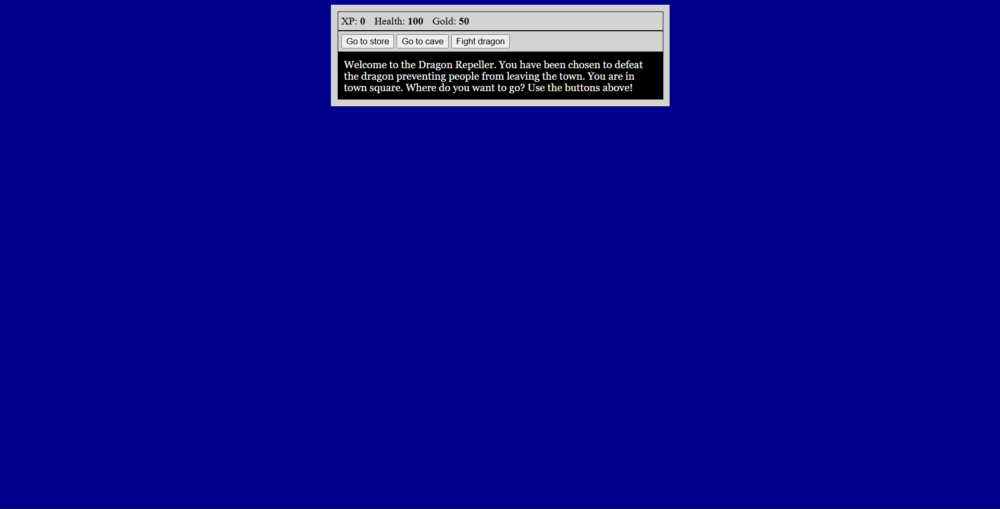
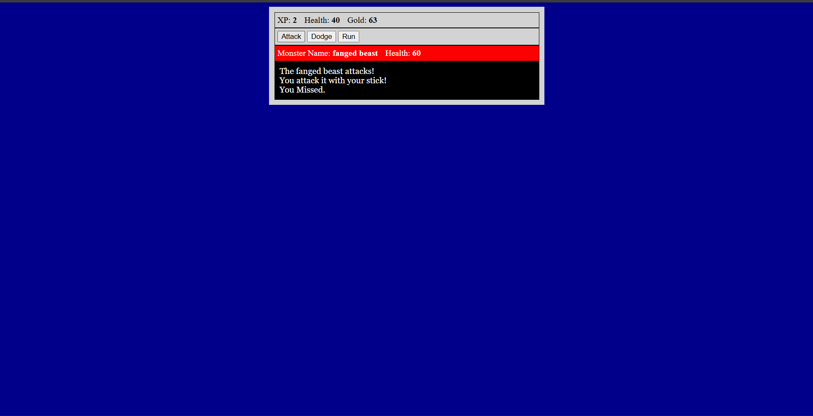

Dragon Repeller – JavaScript RPG Game

A browser-based role-playing game built using vanilla JavaScript, HTML, and CSS.
The project focuses on JavaScript fundamentals such as game state management, control flow, and DOM manipulation.

🚀 Features

Interactive text-based RPG gameplay

Player stats tracking (XP, health, gold, inventory)

Multiple locations (town, store, cave)

Turn-based combat system with different monsters

Weapon upgrades and inventory management

Randomized outcomes (attacks, dodges, easter egg game)

Win/lose game states with replay option

🛠️ Tech Stack

HTML – structure and layout

CSS – basic styling

JavaScript (ES6) – game logic and DOM manipulation

No frameworks or libraries were used.

🧠 Concepts Practiced

DOM manipulation

Event handling

Arrays and objects

Functions and control flow

Game state management

Random number generation

Conditional rendering

📂 Project Structure
├── index.html
├── styles.css
└── script.js

▶️ How to Run Locally

Clone the repository:

git clone https://github.com/your-username/javascript-rpg-game.git

Open index.html in any modern web browser.

Start playing.

📸 Screenshots

📌 Notes

This project was built as a learning exercise to strengthen core JavaScript skills.

It does not include a backend or persistent storage.

Future improvements could include saving game state, enhanced UI, or conversion to a framework-based implementation.

👤 Author

Rayne